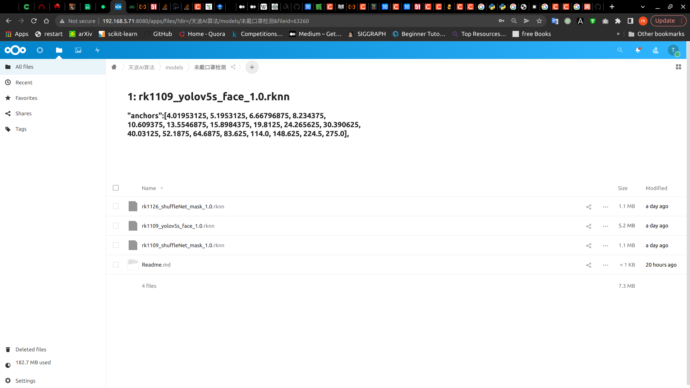
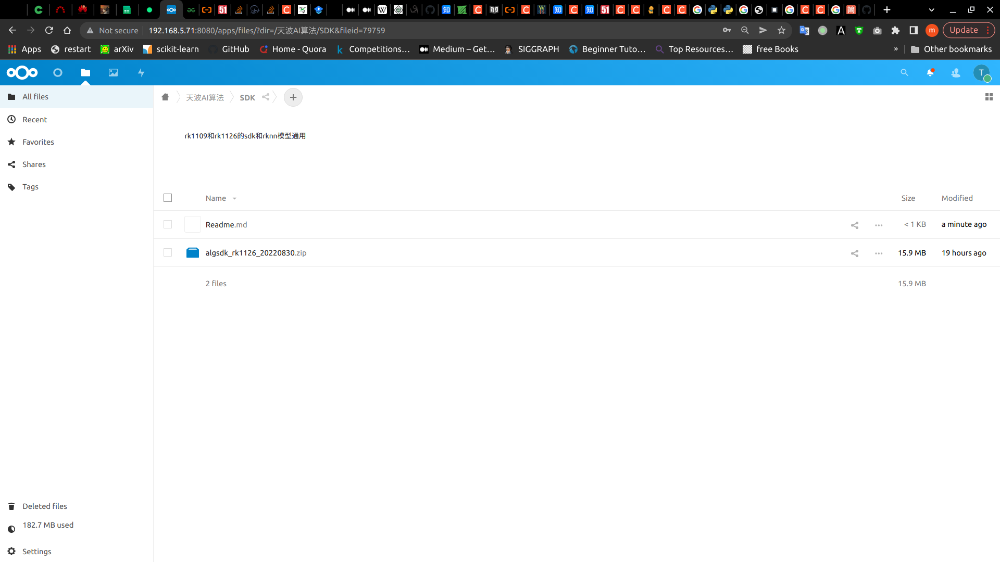
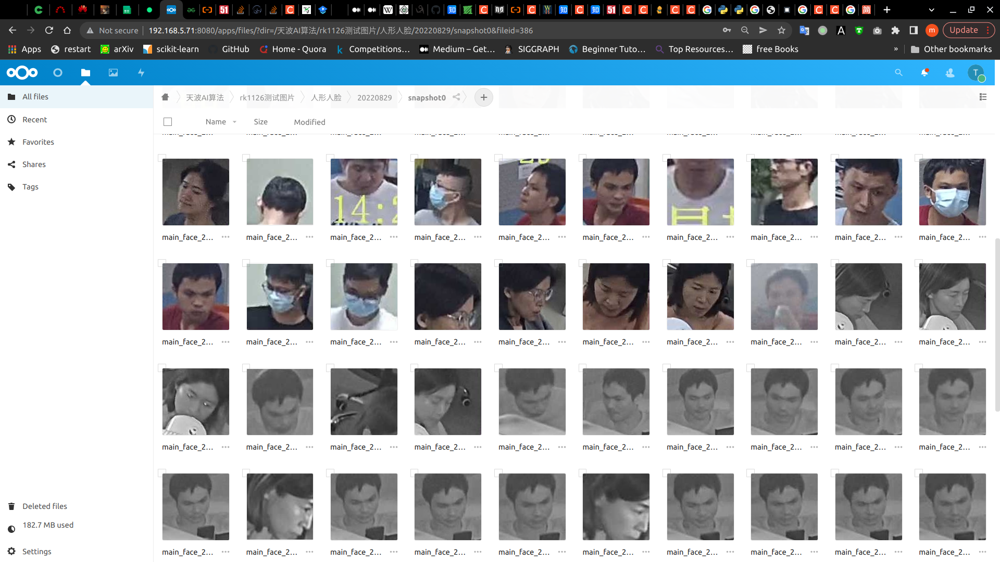

# AI算法库telpo_algsdk介绍

​		为rk3588，rk3566，rk3568，rk1109, rk1126等瑞芯微带有npu的芯片提供统一调用npu的接口API，目前实现的模型主要是检测yolo和分类shufflenet网络。

## 1：基本信息

当前库版本：1.1

最初编辑日期：2022年 07月 26日 

最新修改日期：2022年 08月 31日 

主要修改内容：新增算法功能, 以及相应资料归档在nextcloud网盘上

编辑人：孙永聪

库位置：http://192.168.5.71:8080/s/6Hc77kwpkdc9gba

依赖：opencv, nlohmann

SDK库目录结构如下：

```text
.
├── 3rdparty
│   ├── glog
│   ├── librknn_api
│   ├── nlohmann
│   └── opencv
├── a.out
├── bin
│   └── demo_test_image
├── CMakeLists.txt
├── demo_test_image.cpp
├── demo_test_rtsp.cpp
├── include
│   └── telpo_algsdk.h
├── lib
│   ├── libtelpoalgsdk.so -> libtelpoalgsdk.so.1.0
│   └── libtelpoalgsdk.so.1.0
├── result.jpg
├── test.cpp
├── test.jpg
├── test_json.cpp
```


## 2：算法功能

- [x] 人形检测
- [x] 人脸检测
- [x] 检测未戴口罩的人脸
- [x] 人头检测
- [x] 检测未戴安全帽的人头
- [ ] 检测未穿反光衣的人
- [x] 机动车检测
- [ ] 非机动车检测
- [x] 电动车进电梯检测
- [x] 吸烟检测
- [ ] 打电话检测
- [x] 烟雾检测
- [x] 明火检测

后续完成的算法应用都会以如下形式出现在telpo_algsdk.h头文件的telpo_algsdk_t中，供查看。

*注意---以TELPO_ALGSDK_XXX形式定义算法应用, 相应的json配置文件形式为xxx.json

```cpp
/**
 * @brief: telpo model application
 * @details: 定义模型算法应用
 */
typedef enum {
    /*********人相关算法*********/
    TELPO_ALGSDK_PERSON    = 0,     //detect person人形检测
    TELPO_ALGSDK_FACE      = 1,     //detect face人脸检测
    TELPO_ALGSDK_NOMASK    = 2,     //detect face without mask检测没戴口罩的人脸
    TELPO_ALGSDK_HEAD      = 3,     //detect head人头检测
    TELPO_ALGSDK_NOHAT     = 4,     //detect head without hat检测没戴帽子的人头(安全帽)
    TELPO_ALGSDK_SMOKER    = 5,     //detect smoker吸烟人
    TELPO_ALGSDK_CALLER    = 6,     //detect caller打电话人(还没实现)
    /*********车相关算法*********/
    TELPO_ALGSDK_CAR       = 10,    //detect car机动车检测
    TELPO_ALGSDK_EBIKE     = 11,    //detect eBike电动车
    TELPO_ALGSDK_FJDC      = 12,    //非机动车检测(还没实现)
    /*********其他*********/
    TELPO_ALGSDK_FIRE      = 20,    //detect fire明火检测
    TELPO_ALGSDK_SMOG      = 21,    //detect smog烟雾检测
}telpo_algsdk_t;
```


## 3：使用示例

一：基本数据类型介绍

-  telpo_algsdk_t，用于指定初始化算法的类型，详细见功能部分介绍

- telpo_object_t，用于保持检测到的结果

- telpo_rect_t，矩形框结构体

  ```cpp
  typedef struct telpo_rect_t
  {
      int left;
      int top;
      int right;
      int bottom;
  }telpo_rect_t;
  /**
   * @brief: define object: location and probability
   * @details: 定义目标物体的位置和置信度的概率
   */
  typedef struct telpo_object_t
  {
      /* data */
      telpo_rect_t box;
      float prob;
      int label=-1;
  }telpo_object_t;
  ```

二：引用头文件

```cpp
#include<telpo_algsdk.h>
#include<opencv2/core/core.hpp>
#include<opencv2/imgproc/imgproc.hpp>
```

三：算法初始化

```cpp
telpo_algsdk_t algsdk_t= TELPO_ALGSDK_PERSON;
Telpo_algsdk algsdk;
algsdk.init(algsdk_t);
```

四：推理过程

```pwd
std::vector<telpo_object_t> retObjects;
cv::Mat img = cv::imread(img_path);//根据现实情况获取img。这里是根据路径获取
algsdk.process(img, retObjects);
```


## 4：demo运行

一：在Linux系统中设置环境变量TELPO_ALGSDK_MODEL，为算法应用找到模型和配置文件的路径

```bash
cd telpo_algsdk_model/
export  TELPO_ALGSDK_MODEL=`pwd`
```

二：添加telpoalgsdk.so动态库

```bash
LD_LIBRARY_PATH=$LD_LIBRARY_PATH:${TELPO_ALGSDK_MODEL}/../lib
```

三：运行人形检测算法，结果保存在result.jpg

```bash
./demo_test_image  0 test.jpg
```

测试其他算法功能，请选择其他数字，如下：

```cpp
switch (std::stoi(argv[1]))
    {
    case 0:
        algsdk_t = TELPO_ALGSDK_PERSON;
        break;
    
    case 1:
        algsdk_t = TELPO_ALGSDK_FACE;
        break;

    case 2:
        algsdk_t = TELPO_ALGSDK_NOMASK;
        break;
    //等等
    default:
        std::cout<<"arguments errors\n";
        break;
    }
```

## 5：配置文件解析

以xxx.json文件出现，方便更换模型和设置参数。以face.json说明如下：

```json
{
    "modelDet":"yolov5s_face_1.0.rknn",

    "totalLabels":1,

    "labelName":[],

    "threshObj":0.5,

    "threshDet":0.3,

    "threshNMS":0.5,

    "anchors":[4.01953125, 5.1953125, 6.66796875, 8.234375, 10.609375, 13.5546875, 15.8984375, 19.8125, 24.265625, 30.390625, 40.03125, 52.1875, 64.6875, 83.625, 114.0, 148.625, 224.5, 275.0]
}

```

参数介绍：

- modelDet，模型权重参数
- totalLabels，标签个数
- threshObj，可以设置的范围0~1，阈值越大检测出的框越少 
- threshDet，可以设置的范围0~1，阈值越大检测出的框越少 
- threshNMS，可以设置的范围0~1，阈值越大检测出的框越多
- anchors, 需要和rknn模型配套

## 6 ：相关资料归档

为了方便共享rknn模型、SDK库、查看测试算法的输出图片等，搭建了nextcloud网盘服务器。

内网访问地址: http://192.168.5.71:8080/login

账号/密码:telpo


一：RKNN模型



二：SDK库



三：算法测试输出的效果图片




